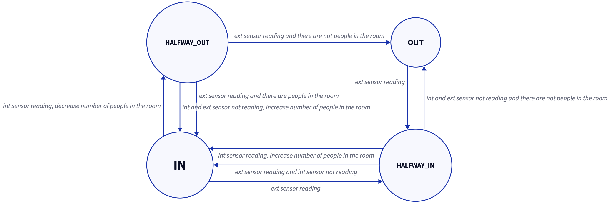

# STYLEGUIDE-micro 

Code for the demo of the [STYLEGUIDE](https://github.com/SaverioNapolitano/STYLEGUIDE.git) project. 

**Physical design** 

**Schematic design** 

> [!WARNING] 
> In the original demo, 3 potentiometers were used to tune the rgb colors.
> In the original demo, the field of vision of the pir sensors was reduced to fit the purpose of the demo. 

> [!CAUTION]
> To be able to work properly, the demo requires a CP2102 Module (USB to TTL) with RX connected to pin 8 and TX connected to pin 7.

## Purpose 

The microcontroller is responsible for sending the [bridge](https://github.com/SaverioNapolitano/STYLEGUIDE-bridge.git) signals triggered by actions performed by the user or changes in the environment, using a rudimentary event-driven architecture. 

It also manages the status of the light and keeps track of the number of people currently in the room.

## How it works 

The bridge and the microcontroller talk to each other over a (software) serial connection, while the physical one is used for debugging. 

### Serial Protocol

#### Micro -> Bridge 

The communication protocol is lightweight and straightforward: each event is encoded in a byte which is then sent to the bridge. 

The encoded events involves
- the light status (`ON`/`OFF`) and its cause (`AUTO`/`SWITCH`/`MOBILE_APP`/`VOICE`)
- the color 
- the light intensity (`HIGH`/`MEDIUM`/`LOW`)
- the user preferences, e.g. if the auto mode is enabled (`AUTO_ENABLED`) or disabled (`AUTO_DISABLED`)
- the number of people in the room, computed using an offset (`peopleInTheRoomWithOffset`)

#### Bridge -> Micro

The bridge can send the micro either one or four integers:
- one integer to toggle the auto mode (or to disable it)
- four integers to set the color of the light and tell the mode used (`MOBILE_APP`/`VOICE`)

### State

To determine its behaviour, the micro uses a finite state machine (FSM) to keep track of how many people are in the room by counting who enters and who exits. 

> [!CAUTION]
> Due to physical impediments, the prototype is not able to detect multiple people entering or exiting at the same time.

**FSM** 

> [!IMPORTANT]
> The above finite state machine only applies if the `AUTO` mode is on.

## TODO

- [ ] From serial connection to bluetooth 
- [ ] Detect multiple people entering or exiting at the same time
- [ ] Decouple the code for the motion sensor from the code for the actuators and the natural light sensor (see [here](https://github.com/SaverioNapolitano/STYLEGUIDE/tree/main#architecture))

